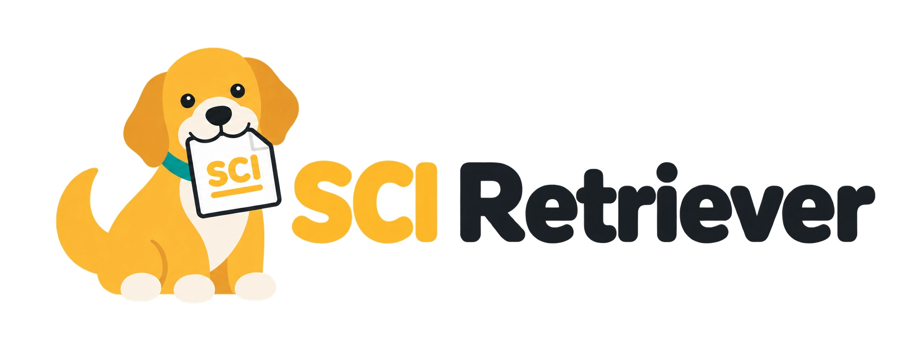

<p align="center">
  <picture>
    <source media="(prefers-color-scheme: dark)" srcset="assets/sci-retriever-logo-dark.png">
    <source media="(prefers-color-scheme: light)" srcset="assets/sci-retriever-logo.jpg">
    
  </picture>
</p>

# SCI 논문 원문 수집 스킬 패키지
논문 본문·SI PDF 파일을 자동으로 수집하고,<br>
LLM이 다루기 쉬운 markdown 파일로 자동 변환 및 색인화

<br>

## 구성

| skill | 용도 | 기능 | 권장모델 |
|-------|------|------|:--------:|
| **sci-retr** | 수집, 변환 | 본문·SI PDF 다운로드, 본문 text를 md 파일로 변환 | Sol / Opus |
| **sci-index** | 색인 | 서지 정보(제목 저널 저자 연도 키워드 초록 등)를 csv 파일로 정리 | Luna / Sonnet |
| **sci-tldr** | 한줄요약 (선택사항) | 한국어 한 줄 요약 생성, csv에 추가 | Luna / Sonnet |

⚠️ codex(chatgpt) 사용권장. claude code는 captcha 클릭 불가능, 사용자가 대신 눌러줘야 함.

<br>

## 설치

codex, claude code (claude 데스크탑 앱에서 code) 대화창에

```
https://github.com/angmond1/sci 설치해줘
```

설치지침: codex는 [CODEX.md](CODEX.md), claude는 [CLAUDE.md](CLAUDE.md)

<br>

## 준비물

1. **KIST 사내 인터넷 망 또는 kvpn 접속**

<br>

2. **chatgpt 또는 claude 유료 계정과 데스크탑 앱 (또는 CLI) 설치**
   * codex (chatgpt) 설치 https://openai.com/ko-KR/codex/
   * claude 설치 https://claude.com/download

<br>

3. **Chrome 설정**
   * `chrome://settings/content/pdfDocuments` 에서 "PDF 다운로드" 선택
   * `chrome://settings/downloads` 에서 "다운로드 전에 각 파일의 저장 위치 확인" 선택 해제

<br>

4. **Codex에 chrome-devtools-mcp 설치, Chrome chatgpt 확장 프로그램 설치**
   * codex 대화창에 "chrome-devtools mcp 설치해서 사용가능하게 해줘" → 설치 후 codex 재시작
   * Chrome chatgpt 확장 프로그램 설치 https://chromewebstore.google.com/detail/chatgpt/hehggadaopoacecdllhhajmbjkdcmajg?pli=1

   그리고 나서 codex app에서 좌하단 이니셜 클릭 → 설정 → 좌측 탭의 "컴퓨터 사용" → Google Chrome 사용

<br>

※ **Claude 사용시**
   * 대화창에 "chrome-devtools mcp 설치해서 사용가능하게 해줘" → 설치 후 claude 재시작
   * 확장 프로그램 Claude in Chrome 설치 https://chromewebstore.google.com/detail/claude/fcoeoabgfenejglbffodgkkbkcdhcgfn

   그러고 나서 Claude Desktop: 좌하단 이니셜 클릭 → "설정" 클릭 → 좌측 탭에서 "Claude in Chrome 설정" 클릭 → "Claude in Chrome 사용설정" 켜기.

<br>

## 사용법 예시

스킬이름 몰라도 "리버", "김리버", "댕댕아" + 원하는 내용 치면 됩니다.

* 논문 PDF 파일이나 웹 링크를 codex, claude code 대화창에 주면서,<br>
  "리버야, 이 논문의 reference 논문들 모두 수집해줘. 캡챠도 네가 눌러줘."

* Web of Science, Scopus에서 수집하고자 하는 논문 리스트를 파일로 저장하고,<br>
  ([Web of Science 검색](https://www.webofscience.com/wos/woscc/smart-search) · [Scopus 검색](https://www.scopus.com/pages/home#basic))<br>
  codex, claude code 대화창에 리스트 파일을 주면서,<br>
  "김리버씨, 첨부한 논문 리스트를 모두 수집해주세요."

<br>

## 출판사별 수집 방법

| 출판사 | 조건 | 수집 방법 | 간격 |
|---|---|---|---|
| Wiley | 개인 TDM 토큰 있음<br>[TDM 토큰 발급 페이지](https://onlinelibrary.wiley.com/library-info/resources/text-and-datamining) | 파이썬 API | 5초 |
| Wiley | TDM 토큰 없음 | 웹 다운로드 | 40초 |
| Elsevier | API key 있음 + Open access 논문<br>[API key 발급 페이지](https://dev.elsevier.com/) | 파이썬 API | 3초 |
| Elsevier | 유료 논문 또는 API key 없음 | 웹 다운로드 | 30초 |
| Springer, Nature, Frontiers, PLOS, Beilstein, Copernicus, APS, Cambridge | - | 파이썬 | 2-15초 |
| MDPI | - | 웹 다운로드 | 본문·SI 완료 후 다음 편 |
| ACS, RSC, IOP, Science, Taylor & Francis, PNAS, AIP, Oxford, IEEE, ChemRxiv | - | 웹 다운로드 | 20초 |

⚠️ 웹 다운로드 수집시 claude code는 captcha 클릭 불가능, 사용자가 대신 눌러줘야 합니다. codex(chatgpt) 사용권장.<br>
⚠️ 최초 1-2회는 과정을 지켜봐주면서 실수를 알려주길 권장합니다.<br>
⚠️ 토큰·API 키를 채팅창에 입력하면 타인에게 노출될 수 있습니다.<br>
KIST 미구독 출판사는 초록만 저장합니다.<br>
Elsevier 기관 API key, Wiley 기관 TDM 토큰, ACS API key는 발급 거절당함 ('26.02).

<br>

## 문의

이동기 / 청정에너지연구센터 e-chemical 연구팀<br>
dnklee@kist.re.kr
